# 🚀 Deploy and Configure Nginx Web Server Using Ansible  
**Professional DevOps Automation Project**

---

## 📌 Project Overview
This project demonstrates the automated deployment and configuration of an Nginx web server using Ansible.  
It follows industry-standard DevOps best practices including secure SSH authentication, role-based architecture, idempotent configuration management, and infrastructure validation.

The automation was executed from an Ansible control node to a target node within a private VPC, ensuring secure and scalable infrastructure management.

---

## 🎯 Project Objectives
- Automate Nginx installation and configuration using Ansible
- Implement role-based Ansible architecture
- Deploy a custom web page using Ansible templates
- Validate service availability and infrastructure connectivity
- Demonstrate idempotent automation
- Apply secure SSH and security group configurations

---

## 🏗️ Architecture Overview
- **Ansible Control Node:** Ubuntu Linux EC2 instance  
- **Target Node:** Ubuntu Linux EC2 instance (private IP)
- **Networking:** AWS VPC (private communication)
- **Automation Tool:** Ansible
- **Web Server:** Nginx

The control node manages the target node using SSH key-based authentication over private networking.

---

## 🔐 SSH Key Management
Separate SSH key pairs were used to enforce security best practices:

- `ansible-controller.pem`  
  Used for secure SSH access from the local machine to the Ansible control node.

- `ansible-host.pem`  
  Used by the Ansible control node to access the target node over the private VPC network.

The target node key was securely transferred to the control node and protected with strict file permissions (`chmod 400`).

Additionally, a dedicated SSH key pair was generated on the control node for Ansible automation.  
This enabled **passwordless SSH authentication**, ensuring non-interactive automation and aligning with real-world DevOps practices.

---

## 🔐 Security Group Configuration
Security groups were configured following the **principle of least privilege**.

### 🟦 Ansible Control Node Security Group
- **Inbound**
  - SSH (Port 22) — restricted to administrator IP only
- **Outbound**
  - All traffic allowed

### 🟩 Nginx Target Node Security Group
- **Inbound**
  - SSH (Port 22) — allowed only from the Ansible control node security group
  - HTTP (Port 80) — allowed from the internet
- **Outbound**
  - All traffic allowed

This design ensures secure administrative access while exposing only required services.

---

## 🛠️ Technologies Used
- Ansible
- Nginx
- Ubuntu Linux
- SSH
- AWS EC2 & VPC
- Git

---

## 🗂️ Project Structure
```bash
deploy-nginx-ansible/
├── ansible.cfg
├── inventory/
│   └── hosts.ini
├── playbooks/
│   └── deploy-nginx.yml
├── roles/
│   └── nginx/
│       ├── tasks/
│       ├── handlers/
│       ├── templates/
│       └── vars/
├── screenshots/
└── README.md
```
This structure follows Ansible role-based best practices and supports scalability and maintainability.

## ⚙️ Setup & Configuration
### 1️⃣ Install Ansible (Control Node)
bash
Copy code
sudo apt update
sudo apt install ansible -y
### 2️⃣ Configure Inventory
ini
Copy code
[web]
web1 ansible_host=<TARGET_NODE_PRIVATE_IP>
### 3️⃣ Validate Connectivity
bash
Copy code
ansible web -m ping
Successful output confirms SSH connectivity and inventory correctness.

## 🚀 Deployment
Run the Ansible playbook from the project root:

bash
Copy code
ansible-playbook playbooks/deploy-nginx.yml
This playbook:

Updates package cache

Installs Nginx

Ensures the service is running and enabled

Deploys a custom HTML page using a Jinja2 template

Restarts Nginx via handlers when configuration changes occur

## ♻️ Idempotency Validation (CRITICAL)
The playbook was re-executed to validate idempotency.

On the second run:

text
Copy code
changed=0
This confirms that the automation enforces the desired state without reapplying changes, demonstrating correct idempotent behavior — a key DevOps requirement.

## 🌐 Verification & Validation
Nginx service status verified as active (running)

Custom web page successfully loaded via browser

SSH connectivity validated between control and target nodes

Passwordless SSH confirmed for automation readiness


## ✅ Project Outcome
Fully automated Nginx deployment using Ansible

Secure, role-based infrastructure configuration

Idempotent and repeatable automation

Production-aligned DevOps workflow

Deployment validated at infrastructure and application levels

## 🏁 Conclusion
This project demonstrates practical DevOps automation using Ansible in a real-world infrastructure scenario.
It highlights secure access control, configuration management, automation reliability, and professional documentation — all essential skills for modern DevOps engineering.

## Below are screenshots of workflow:
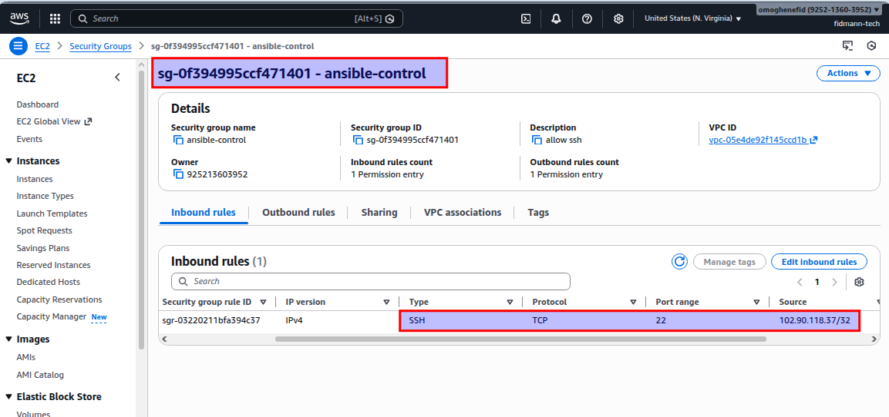

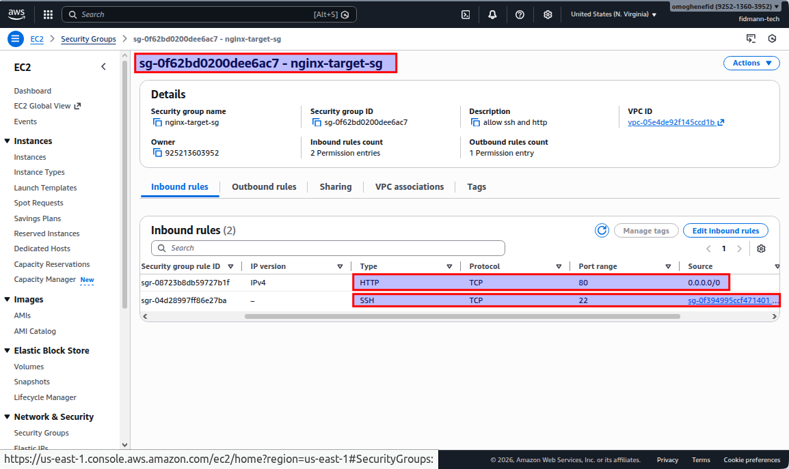
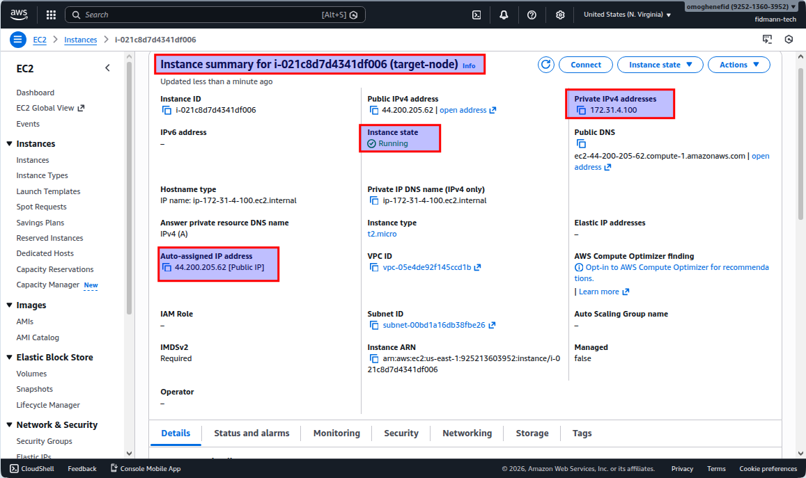
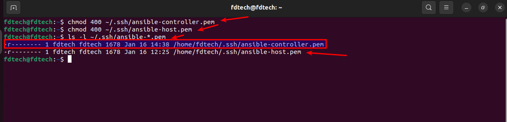
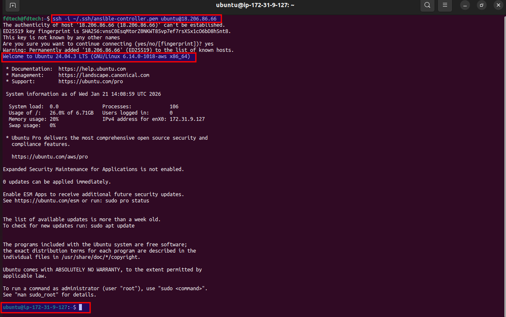

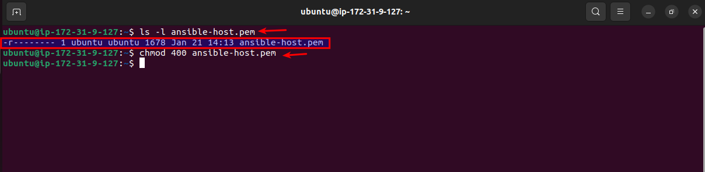
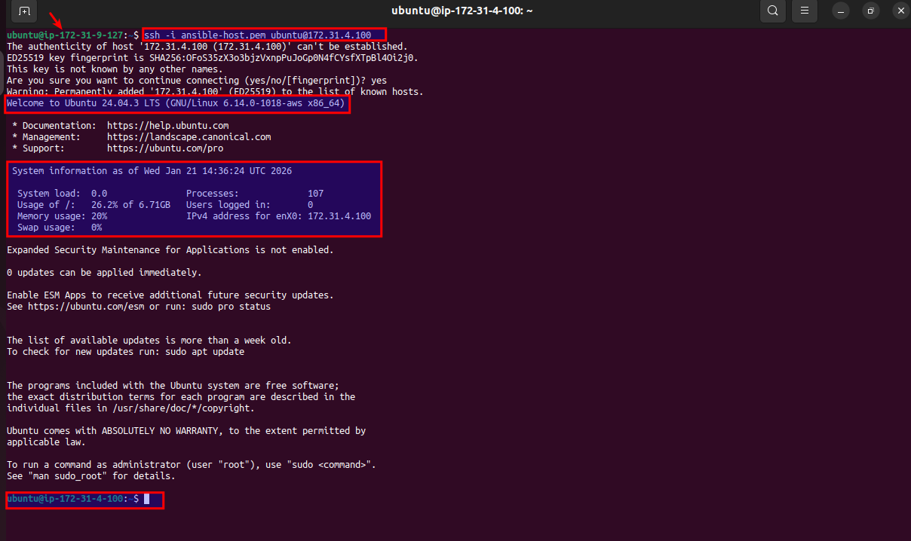
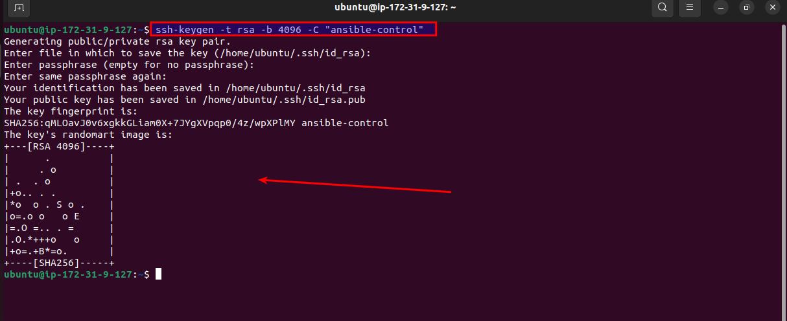
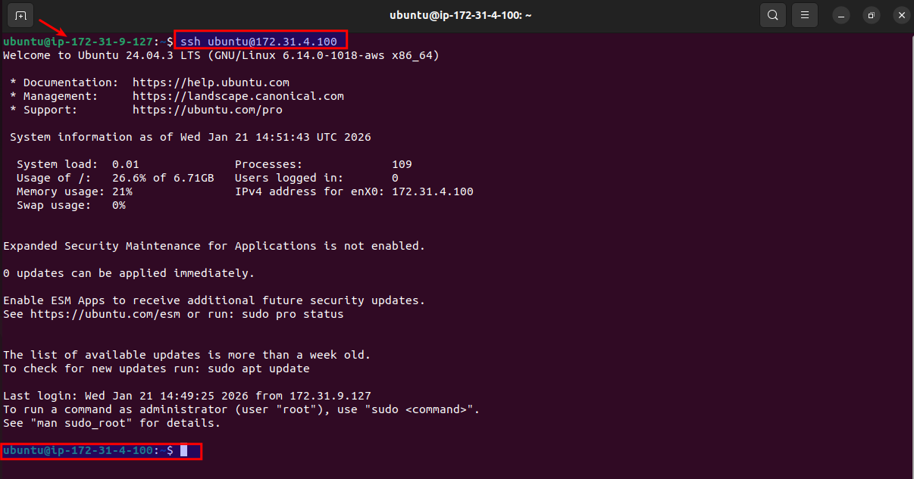
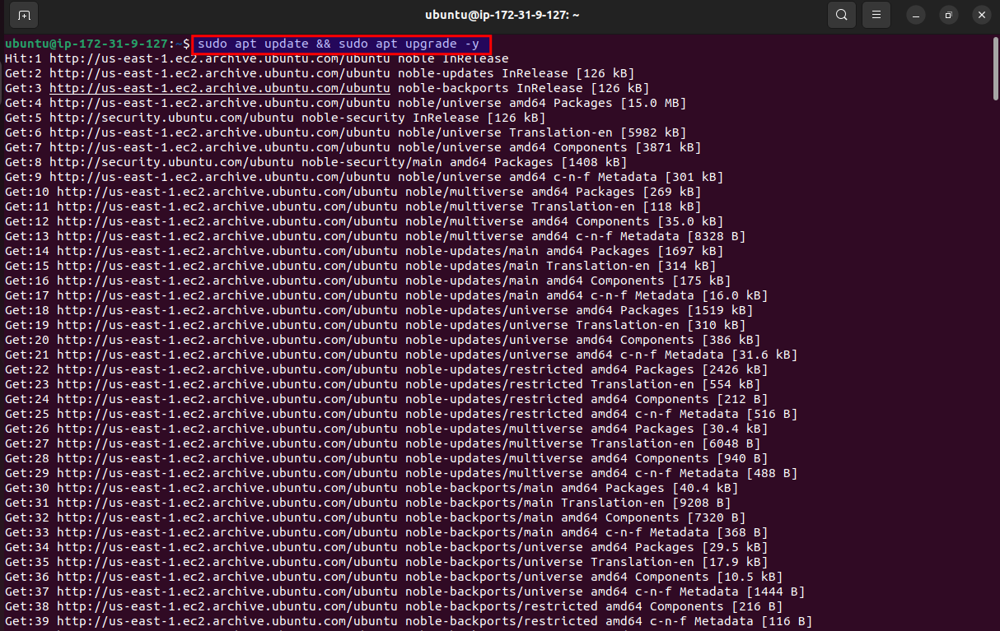
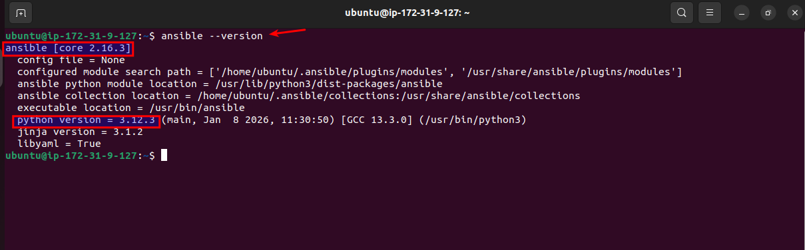
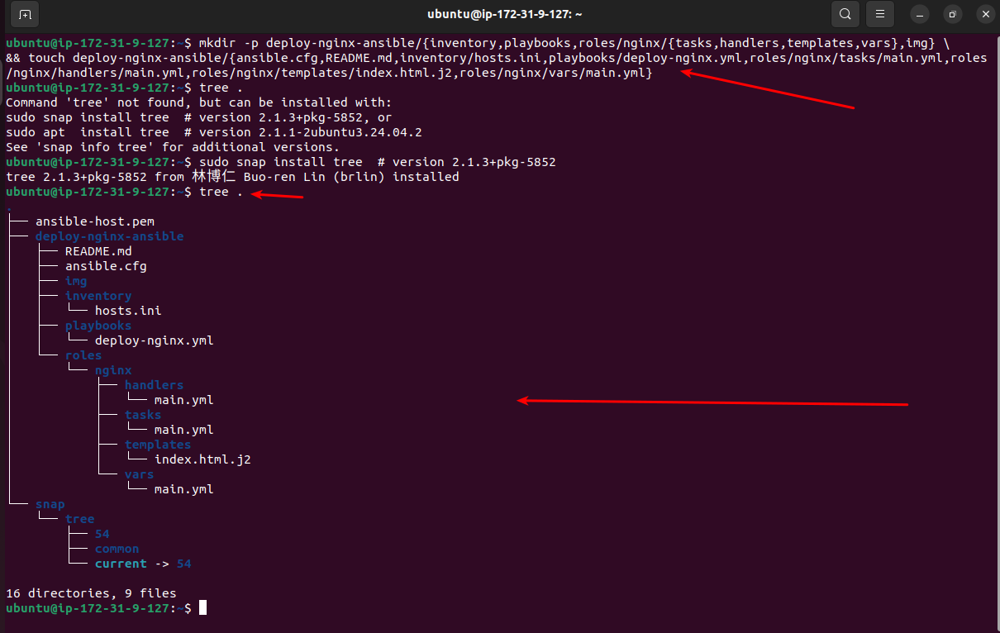

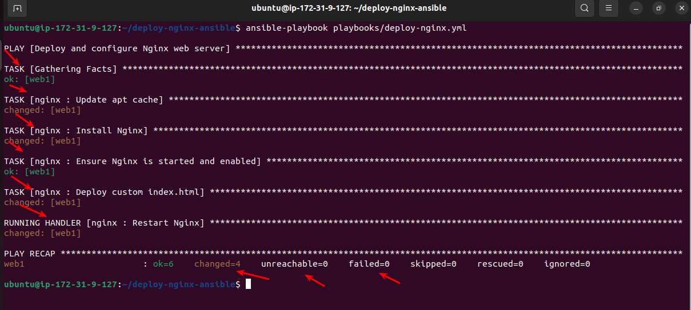
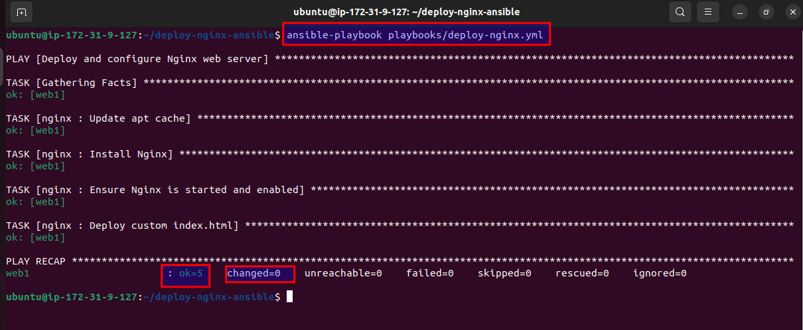
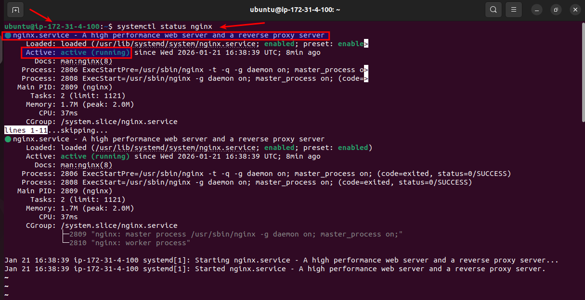
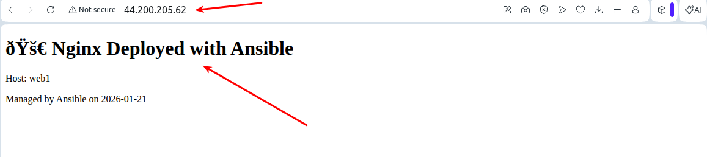
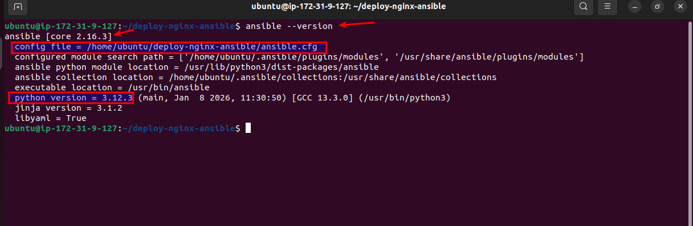
